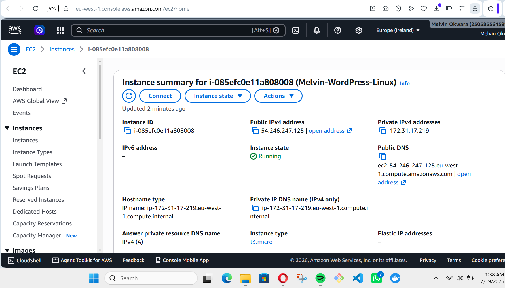
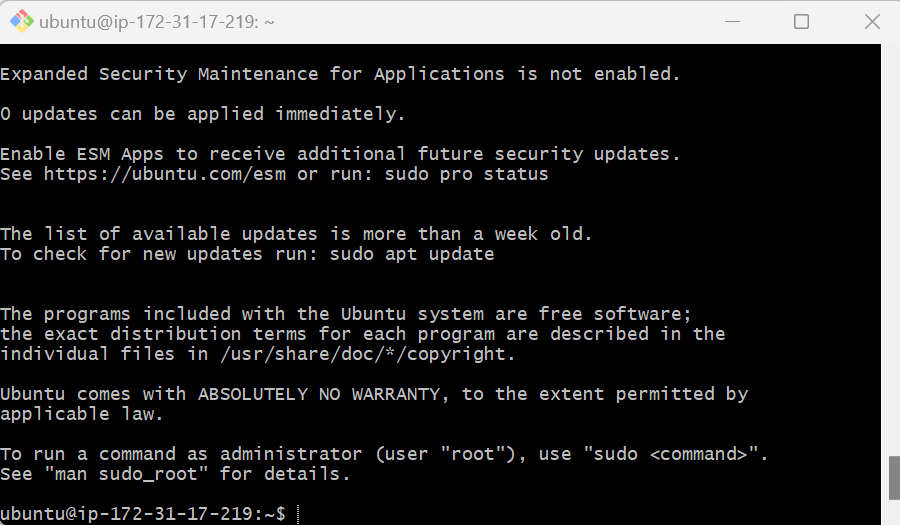
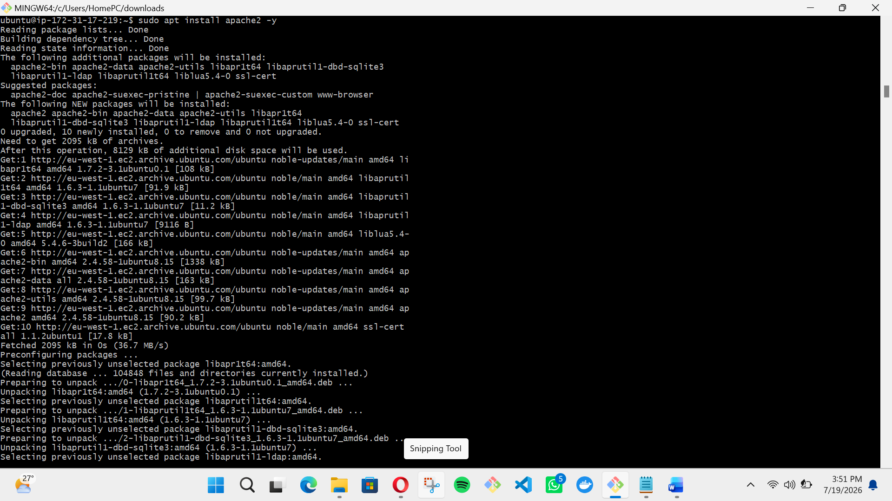
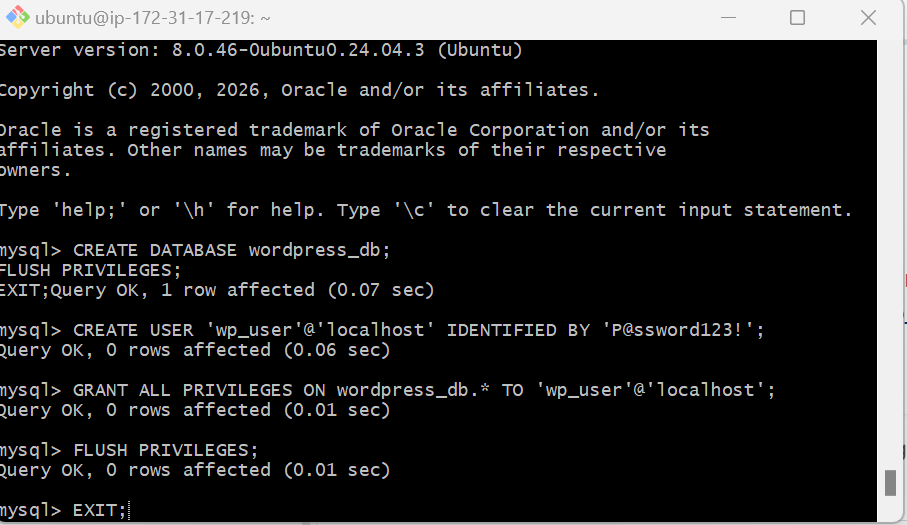
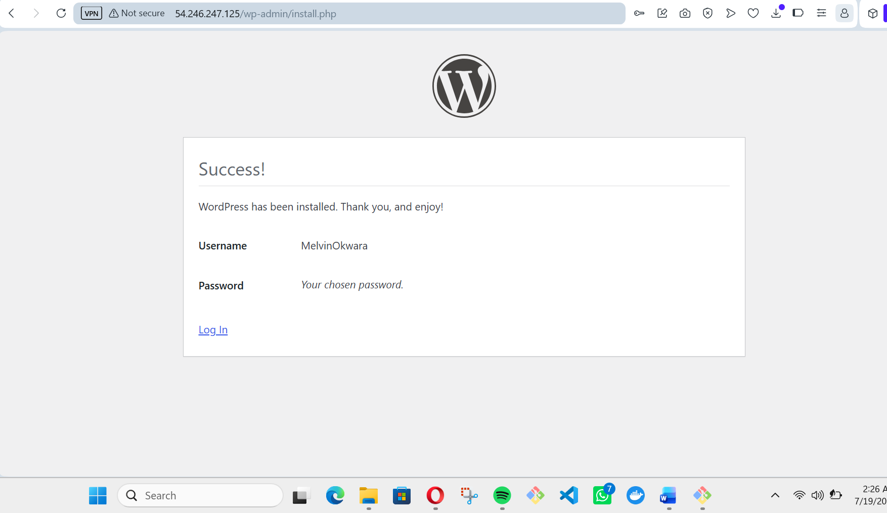

# WordPress Deployment on Ubuntu 24.04 LTS

---

## 1. Instance Provisioning
**Rationale:** I provisioned an Ubuntu 24.04 LTS instance on AWS EC2, ensuring the security group was configured with **Port 22 (SSH)** for management and **Port 80 (HTTP)** for public web access.

---

## 2. Remote Access (SSH)
**Rationale:** Accessed the server using an **RSA-encrypted SSH key pair** to establish a secure, encrypted tunnel for administrative tasks.

---

## 3. LAMP Stack Installation
**Rationale:** Deployed the **LAMP stack** (Linux, Apache, MySQL, PHP). Apache serves as the web server, MySQL manages the relational data, and PHP processes the WordPress application logic.

---

## 4. Database Configuration
**Rationale:** Followed the **Principle of Least Privilege** by creating a dedicated database and a non-root user with specific permissions for the WordPress application.

---

## 5. Final Deployment
**Rationale:** Integrated the WordPress core files with the MySQL backend and verified the deployment via the **Public IP**.

---
*Project completed on AWS Cloud Infrastructure.*
